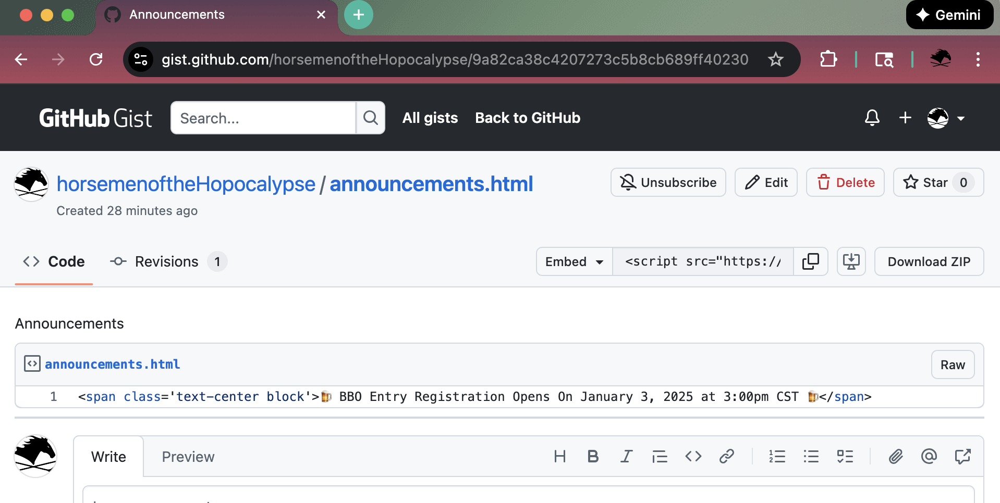

import { FileTree } from '@astrojs/starlight/components';

The `config.json` file for the site:

<FileTree>

- src
  - config
    - config.json
  - content
</FileTree>

contains an item for Announcement that looks like this:

```json
  "announcement": {
    "enable": true,
    "gist_url": "https://gist.githubusercontent.com/horsemenoftheHopocalypse/9a82ca38c4207273c5b8cb689ff40230/raw/243a4ce7a4a50712b66ccb2631f828c5cf11790f/announcements.html",
    "expire_days": 7
  },
```

The `enable` flag controls the visibility of the announcent.

The `gist_url` is where the site looks to find the announcement. This enables us to use GitHub to change an announcements without requiring a full site re-deployment.

`expire_days` controls the shelf-life of the cookie. After 7 days the cookie expires and retrieved from the `gist_uri`




The `Announcement` component generates a hash from the announcement content and checks to see if the hash value from the `gist_uri` has changed. This ensures that users see fresh announcments.