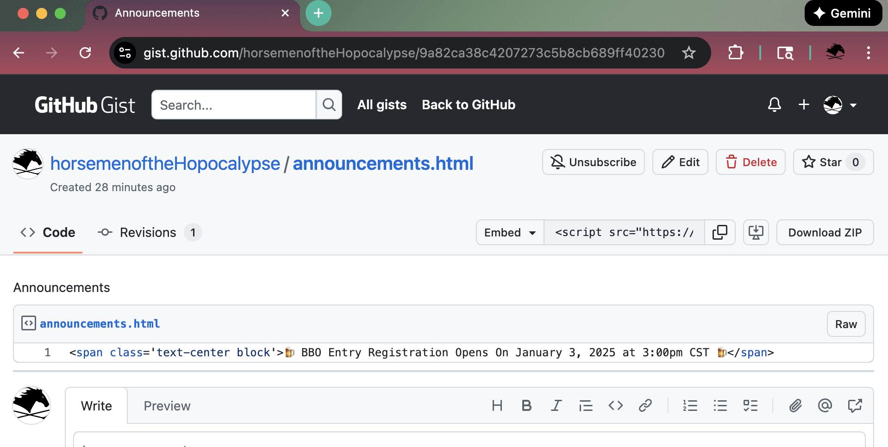

import { FileTree } from '@astrojs/starlight/components';

The `config.json` file for the site:

<FileTree>

- src
  - config
    - config.json
  - content
</FileTree>

contains an item for Announcement that looks like this:

```json
  "announcement": {
    "enable": true,
    "message": "🍺 Spirit of '76 Beer Sort - May 16th, 2pm - Long's House 🍺",
    "expire_days": 7
  },
```

The `enable` flag controls the visibility of the announcent.


`expire_days` controls the shelf-life of the cookie. After 7 days the cookie expires.



The `Announcement` component generates a hash from the announcement content and checks to see if the hash value from the `gist_uri` has changed. This ensures that users see fresh announcments.
